# Sim Universe 宇宙文明模拟

环境：

- python3
- numpy
- pandas

在simuniverse/目录下运行：

> python universe

程序会在项目根目录下创建log文件，其中包含了大量的日志信息。可以在ipython上用helper.py进行相应的可视化与数据处理操作。

附一张用helper.py生成的各个类型文明的兵力发展动图:

上图横纵坐标为文明的主星系的坐标（他们生活在二维世界中），其中红色的为进攻型文明，蓝色的为外交型文明，绿色为保守型文明。上图对应的情境为下面介绍到的情景一：战争死亡率低，但是资源不足。

# 背景

该模型受到刘慈欣《三体》作品的启发，同时也参考了知乎网友[扶保圣清毛东珠](https://www.zhihu.com/question/21296837)的答案。

《三体》后记：

> 我曾经陷入【宇宙文明点状化】的这种思维游戏中不可自拔，上世纪九十年代初，为打发时间，我常常编些无聊但自觉有趣的软件，现在网上重新流行的电子诗人就是那时的产物。那个时期，我还编过一个宇宙点状文明体系总体状态的模拟软件，将宇宙间的智慧文明简化为点，每个点只具有描述该文明基本特征的十几个简单参数，然后将文明的数量设置得十分巨大，在软件中模拟这个体系的整体演化过程。为此我请教了一位可敬的学者，他是研究电网理论的，是建立教学模型的高手，算不上科幻迷但也是爱好者，他对我那个错误百出的模型进行了修正。软件运行时最多的一次曾在十万光年半径内设定了三十万个文明，这个用现在看来很简陋的TUBOC编的程序在286机上运行了几个小时，结果很有趣。当然，我只是个工程师，没有能力进行这样级别的研究，只是一个科幻迷玩玩儿而已，从科学角度讲得出的结果肯定没什么意义，但从科幻角度讲却极有价值，因为那些结果展示的宇宙间点状文明的演化图景，不管正确与否，其【诡异程度】是很难凭空想出来的。

# 问题描述

为了能够测试不同的策略对于一个文明的影响，首先就应当确定这个世界的基本行为与规则以及基本因素。只有在定义了这个世界的基本规则之后才可以将不同策略的文明代入，从而观测不同决策的文明所面临的不同结局。但是因为没有相应的测试数据，很难验证与调整模型当中的参数以及假设行为，所以在本问题中我将设置多种情境，测试在这些情境下各类文明的生存率等因素。

在一个文明系统的模型当中，一个文明的基本要素含有：军事、资源、经济发展和科技实力。资源、经济与科技发展这三者不可分割，经济发展离不开基础资源的开发，经济发展也可以带动科技的进步，科技的进步又可以进一步的促进经济。而军事发展是决定一个文明最终能否生存下去的关键因素，一个没有防御能力的文明往往是不堪一击的。所以军事科技以及军事力量的发展在该问题当中起到了关键的作用。为了表达出基本策略，即外交型、战斗型、保守型，则需要联盟国家和敌对文明的关系。盟军可以提供兵力以及经济支援，而与敌对文明的战争会引起兵力的损耗。当一个文明所占有的资源少于一定程度，或者兵力消耗殆尽则可以将其视作为死亡。

# 假设

1.	所有星系均视作为二维平面上的点。
2.	资源是星系固有不可再生的，资源只有一种类型仅用一个数值来表示。
3.	文明只有三种策略，好战型、外交型、保守型。
4.	外交型文明会主动进行外交，若遇到好战性文明则会造成一定比例的兵力损失，若遇到其它外交型文明或保守型文明则建交。好战型文明遇到任何文明都主动宣战，若战争胜利则占据该领地。保守型文明发现其他文明后不采取任何行动。
5.	任何文明碰到无人星系都会主动占领。
6.	经济方面只考虑劳动力、劳动资料、自然资源、产值四个指标
7.	战争方面只考虑进攻型科技、防御性科技以及兵力
8.	盟国无条件支援更弱的国家。
9.	每个文明在星系上的侦查范围的面积固定增长。
10.	没有末日武器存在，每场战争都要持续一段时间。
11.	盟国之间不会分裂。
12.	在满足其他生产条件（兵力，科技）后才会发展劳动力。

# 模型

在模型的建设中，我主要参考了正规战争模型和道格拉斯生产函数。

|变量名	|含义|
|--------|--------|
|lbf	|劳动力（初始1）|
|mlb	|劳动资料，这里指代促进生产的科技技术 （初始1）|
|lbob	|自然资源（初始~N(50,10)）|
|pd	|产值（初始10）|
|mlst	|兵力（初始10）|
|btTch, dfTch	|进攻技术及防御技术（初始100）|
|dtrange	|文明在星系上的侦测半径 （侦测面积线性增长）|
|attr	|文明的属性（进攻型、保守型或外交型）|

## Lanchester正规战争模型
在正规战争模型当中战斗的双方位置都是对方可见的，每一方的减员率与对方的兵力战斗力以及自身的支援有关，且每一方的非战斗减员率只与本方的兵力成正比。用x(t),y(t)表示甲乙双方在时刻t的兵力，可以得到以下模型：

$$x ̇(t)= -ay-αx+u(t),$$
$$y ̇(t)= -bx-αy+v(t),$$

我们通常可以把α设置为0，也就是不考虑非战争因素引起的减员。并且在这里我们可以将前面提到的btTch,dfTch引入，使战斗力高的文明更容易摧毁另外一个文明。则有：

$$x ̇  (t)=-〖btTch〗_y/〖bfTch〗_x  y+u(t),$$
$$y ̇  (t)=-〖btTch〗_x/〖bfTch〗_y  x+v(t),$$

因为我们这里使用的是离散的系统，所以上式可以转化为：

$$Δx(t)=-〖btTch〗_y/〖bfTch〗_x  y+u(t),$$
$$Δy(t)=-〖btTch〗_x/〖bfTch〗_y  x+v(t),$$

其中的提供增援的国家相应的就减少相应的兵力。

## 道格拉斯生产函数

道格拉斯生产函数是在生产函数的一般形式上做出的改进，引入了技术资源这一因素。用来预测国家和地区的工业系统或大企业的生产和分析发展生产的途径的一种经济数学模型，简称生产函数。是经济学中使用最广泛的一种生产函数形式，它在数理经济学与经济计量学的研究与应用中都具有重要的地位。他们根据有关历史资料，研究了从1899－1922年美国的资本和劳动对生产的影响，在技术经济条件不变的情况下，得出了产出与投入的劳动力及资本的关系。但是柯布－道格拉斯生产函数中把技术水平A作为固定常数，难以反映出因技术进步而给产出带来的影响。

其生产函数的基本形式为：

$$Y=A(t) L^α K^β μ$$

其中Y是工业总产值，A是综合技术水平，L是投入的劳动人数，K是投入资本。根据α 和β的组合情况,它有三种类型：

1. $α＋β>1$, 称为递增报酬型，表明按现有技术用扩大生产规模来增加产出是有利的。
2. $α＋β<1$, 称为递减报酬型,表明按现有技术用扩大生产规模来增加产出是得不偿失的。
3. $α＋β＝1$, 称为不变报酬型，表明生产效率并不会随着生产规模的扩大而提高，只有提高技术水平，才会提高经济效益。

此处我们只考虑第三种情况，且不妨假设α=β=0.5。

将上述模型应用到我们的模型当中只需要更换几个变量就可以，我们可以得到下式：

$$Δpd=k√(lbf·-Δlbob)·mlb$$

上式当中的k为待定系数。

通过上式，我们可以确定文明的资源消耗和产出的关系式，从而更好地模拟文明的经济变量间的关系。

## 侦测行为模型

根据假设9，我们可以得到以下函数：

$$dtrange(t)=α√t$$

而在离散的系统当中若要依次对每一个文明都进行一次上述值的更新并查询落在该范围内的文明有哪些，那么时间复杂度就过高了。所以在此处我利用了事件池的方法来更新dtrange，每一次发起侦测就将”找到最近的星系”的事件添加到事件池当中，并且在该事件中附加上下一次应当更新的dtrange值与找到的时间。事件池是一个优先队列，以时间作为优先级，并会将相应的事件交给对应的处理函数。

所以在处理一个侦测行为时，我们应当考虑两星系间的距离d，以及当前的dtrange，来计算对应的Δt。通过简单计算我们可以得到下式：

$$Δt=(d^2-〖dtrange〗^2)/α^2 $$

之后我们将Δt+t作为事件的权重参数（其他参数包括了d，探测点，被探测点等必要的可描述该侦测行为的参数），将事件添加到事件池当中即可。

## 劳动力变化模型

劳动力变化主要关注点在于开拓一个新的星系时劳动力与产值之间的变化关系。根据假设13，劳动力作为最后的消耗部分，可以将剩余的产值都作为劳动力的生产。但是一个环境当中的劳动力承载能力是有上限的。所以劳动力的增长会随着自身的增长而逐渐放缓。

所以此处我用以下函数来描述劳动力lbf的增长需求：

$$Δlbf=β(1-sigmoid(lbf)) $$

假设$β=1$ 我们可以得到这样一条曲线(纵轴为lbf的变化量，横轴为lbf的值)

通过从零开始依次累加Δlbf我们可以得到下面这条曲线：

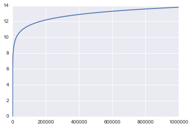
 
上图横轴为迭代次数，纵轴为lbf的值。

可以看到，lbf如预期，在数值很小的情况下有着较高的增速，而lbf的增速随着lbf上升逐渐下降。最终虽然还有一定的增量，但是其增量非常小。

其中lbf的增加应当对应pd产值的减少，遂有：

$$Δpd= -αΔlbf$$

并且，pd的值不能过小，过小的pd值将带来危机，所以最终Δlbf的表达式为：

Δlbf=min⁡{β(1-sigmoid(lbf))/α,pd-5}

军事发展与自然资源消耗模型

军事的发展分为军事科技的发展和军队力量的发展。军队力量mlst的发展在这里我使用以下函数表达：

$$Δmlst=γ(1-mlst)$$

其中的$γ<0.1$。

军事科技的发展与自然资源消耗我使用以时间为变量的线性模型。

# 结果与分析

通过对上述模型的仿真，我们可以通过不同的情境的设置得到不同的模拟结果。下文中我将列举5种情境下的仿真结果，这五种情景没法覆盖到所有的情况之下，但是通过他们之间的对比我们将可以看到不同策略在不同规则下的生存能力，以弥补没有数据和足够的先验知识造成的模型的偏差。通过下面的测试可以看到该模型具有很强的表达能力。

在以下的每一种情景里我都模拟了三种不同的文明数量（100,300,1000）下的情况，其中星系数量始终固定在1000，采取三种不同情况再进行模拟是因为当文明数量少的时候，资源就相对更加丰富，通过不同文明数量的模拟更能反映出问题的本质。

下面每一个情境中都会给出一组图片，其中第一张为100个文明时的生存情况，中间为300个文明，最后一张为1000个文明。该图片中的横轴为时间，纵轴为存活数量，其中的蓝线为外交型的文明，绿线为进攻型文明，红线为保守型文明。

## 情景一：战争死亡率低，但资源不充足

这一种情景当中探讨了资源不充足的时候各个策略的表现。因为引入了资源不充足的情况所以这对于保守型文明是一种考验，因为保守型文明不主动掠夺与结盟，长期依赖于自身的资源，所以它在资源不充足的情况下容易死亡。

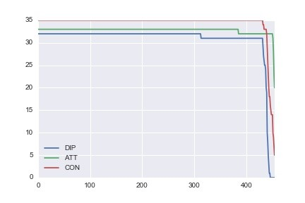
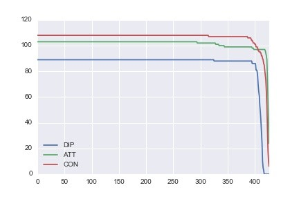

## 情景二：盟军支援充足，资源充足，战争型文明强大
	
这里加强战争型文明的原因是，若盟军的支援很充足，那么显然这对于战争型文明是很不利的。并且好战型的文明没有办法从别的地方获取到别的资源和利益，若不将其加强则其将极快灭亡。而当战争型文明灭亡时，文明间的冲突就少了而失去了观察价值。所以将其加强是合理的。第一张图是保持了一种僵持态。
   

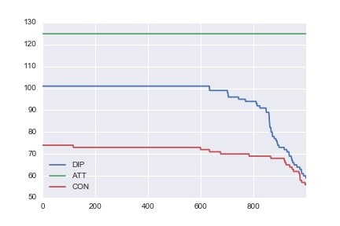
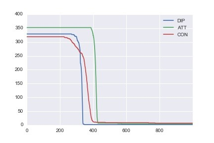

## 情景三：支援少，资源不足

这种情况主要是与其它情景作为对照观察。可以看到在这种情况下外交型文明极易死亡，保守型文明相对于外交型文明更不容易死亡，而好战型文明在这种情况下生存能力最强。

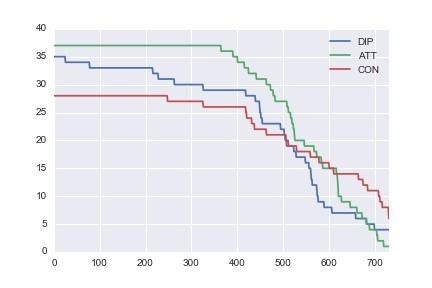

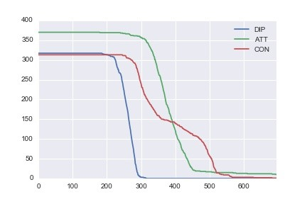
    
## 情景四：支援量适中，资源适中

如下图所示，在这种情况下，三个文明的死亡数呈现高度相似。在前面的大部分时间里，文明之间没有很多因为战争死亡的例子。而在500年（时间单位可以随意调整，用年描述方便一些）左右就开始了因为战争而死亡的例子。而到700至800年可以看到死亡率存在增速，这里是因为资源过少而产生的死亡。因为势均力敌，所以这三条线在后半个模拟阶段基本处于重合的状态
   
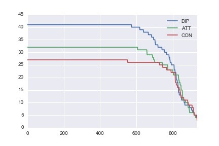

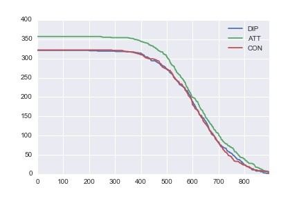

##情景五：探测速度慢，其他量适中

通过与情景四对比，可以发现文明开始死亡的时间延后了很多，并且通过日志文件的分析可以判断得到其死亡原因大都是因为资源不足。左图中，因为无人星系较多，所以资源数量相对多，所以死亡量少；中图则死亡了更大比例的文明数量；右图中可以看到有接近50%的文明都死亡了。
   
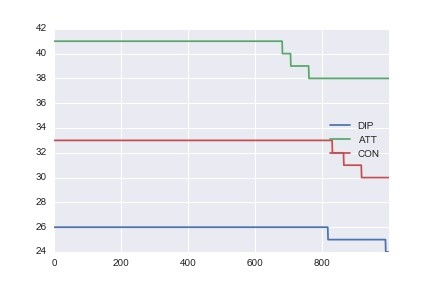
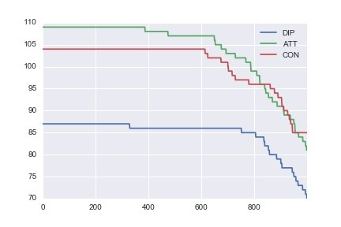
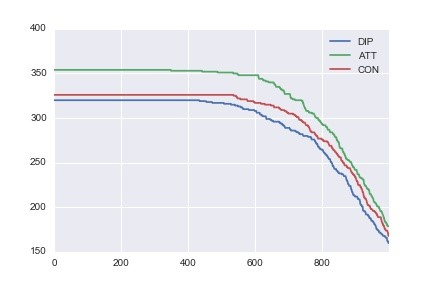
 

# 总结

根据以上仿真结果我们可以观察到，当资源不足时，保守型和外交型的文明相对于进攻型的文明更容易死亡，尤其是当无人星系（含有资源）数量少的时候进攻性文明更容易生存。而当资源充足时，若盟军之间的支援足够及时则进攻型文明则很难生存(除非其有强大很多的科技技术，并且无人星系数量较少)。而在探测速度很慢时，资源就成为了文明能否生存的决定性因素。

综上所述，不可再生资源、在宇宙内的探测速度、含资源的无人星系、盟军支援的及时程度、宇宙内各种策略的文明的构成比例都是决定最佳策略的关键因素。而在上述的所有关键因素当中，最为关键的就是宇宙内不可再生资源相对于文明数量的比例，由仿真的结果可以看到这个比例在决定最佳策略当中占有很大的权重：在资源不足时，好战型策略有更好的表现，在资源充足时，外交型策略往往能存活更久。

## 模型优缺点

1.	该模型考虑了战争、经济、人口迁移等因素，建立了灵活了仿真模型
2.	该模型详细描述了在没有末日武器情况下三种基本策略的在多种情境下的表现情况
3.	通过多种情境的设置解答了问题
4.	由于没有相应的数据，无法验证该模型的正确性
5.	该模型的假设条件过于理想
6.	没有考虑在特殊情境下不同基本策略的文明的策略转换（如在面临强大对手的结盟邀请时，一个好战型的文明不会选择开战）
7.	该仿真模型时间复杂度为O(tn^2)空间复杂度O(n^2+mn)，其中t为仿真迭代次数，n为文明数量，m为星系数量。复杂度过高，还可以进一步简化模型。

